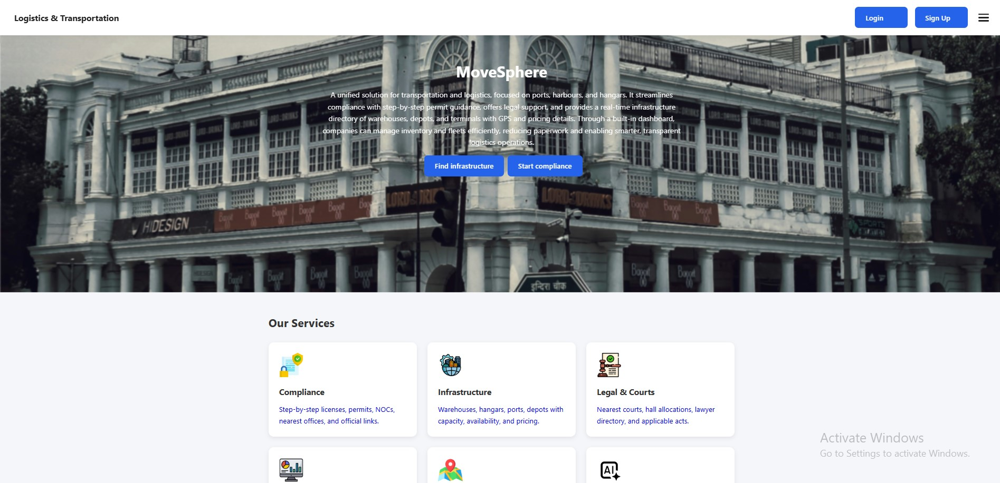
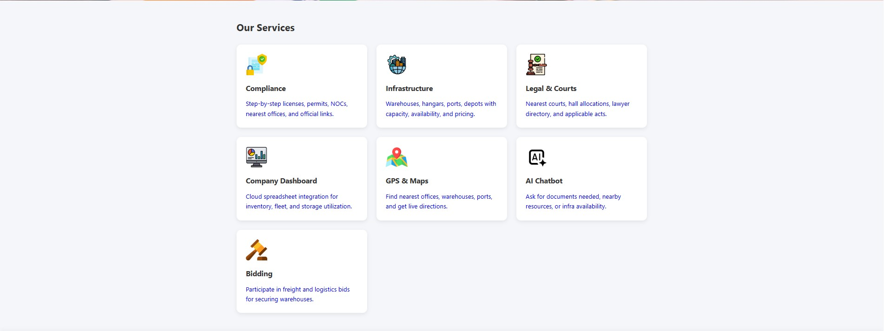
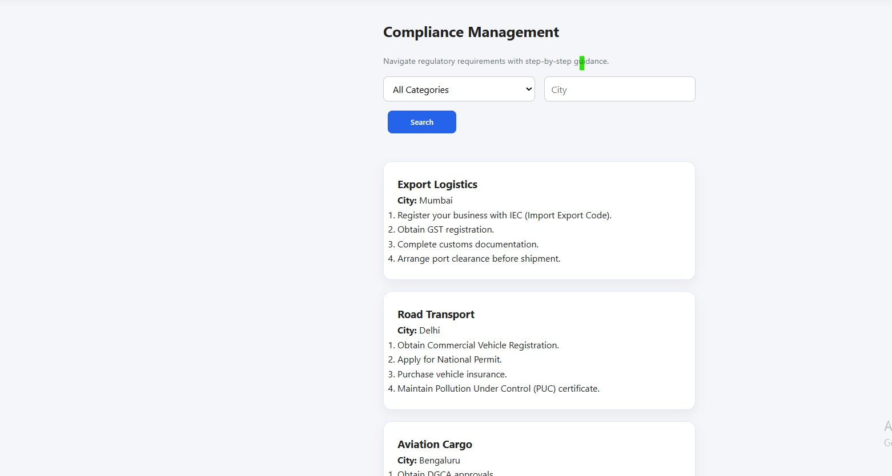

# 🚚 MoveSphere – Smart Logistics & Supply Chain Management Platform

> A modern logistics and supply chain management platform that streamlines warehouse operations, inventory tracking, fleet management, compliance monitoring, and location-based resource discovery through an intuitive web interface.


---

# 🌐 Live Demo

**🔗 Live Website:** https://movesphere-beta.vercel.app

**💻 GitHub Repository:** https://github.com/aishwarya426/movesphere

---

# 📖 Overview

MoveSphere is a modern logistics and supply chain management platform built to simplify logistics operations through a centralized digital dashboard. The application enables businesses to efficiently manage warehouses, inventory, transportation resources, legal compliance, infrastructure information, and location-based services.

The project demonstrates full-stack development concepts including responsive UI design, REST API integration, authentication workflows, CRUD operations, Google Maps integration, and scalable React architecture.


---

# ✨ Features

##  Authentication
- User Registration
- Secure Login
- Local Session Management
- Client-side Validation

## Inventory Management
- View Inventory
- Add Inventory Items
- Edit Inventory Records
- Search Inventory
- Persistent Data Storage

##  Fleet Management
- Manage Fleet Information
- Vehicle Status Tracking
- Add & Edit Vehicles
- Dynamic Search

##  Warehouse Management
- Warehouse Records
- Storage Management
- Capacity Tracking
- Warehouse Editing

##  GPS & Maps
- Google Maps Integration
- Warehouse Location Visualization
- Interactive Markers
- Search Locations

##  Legal Support
- Legal Information Dashboard
- Case Details
- Court Information
- Applicable Regulations

##  Compliance Dashboard
- Compliance Monitoring
- Record Tracking
- Status Management

##  AI Chatbot
- AI-assisted User Guidance
- Logistics Support Interface

##  Responsive Design
- Desktop Support
- Tablet Friendly
- Mobile Responsive

---

# 🛠 Tech Stack

### Frontend
- React.js
- JavaScript (ES6)
- HTML5
- CSS3
- React Router
- Axios

### Backend
- Node.js
- Express.js

### Database
- MongoDB (Original Backend)
- Browser Local Storage (Current Demo Version)

### APIs
- Google Maps JavaScript API

### Tools
- Git
- GitHub
- Visual Studio Code
- Vercel

---

# 📂 Project Structure

```text
MoveSphere
│
├── frontend
│   ├── public
│   ├── src
│   │   ├── components
│   │   ├── styles
│   │   ├── App.js
│   │   └── index.js
│   └── package.json
│
├── backend
│   ├── routes
│   ├── models
│   ├── middlewares
│   ├── config
│   ├── server.js
│   └── package.json
│
└── README.md
```

---

# 🚀 Getting Started

## Clone the Repository

```bash
git clone https://github.com/aishwarya426/movesphere.git
```

Move into the project directory

```bash
cd movesphere
```

# 📸 Application Preview

##  Home Page



---

##  Dashboard



---

##  Compliance


---

##  Legal & Court



---


# 🎯 Future Enhancements

- Role-Based Access Control
- Real-Time Notifications
- Shipment Tracking
- Analytics Dashboard
- AI Demand Forecasting
- Order Management
- Docker Deployment
- Kubernetes Support
- Multi-user Collaboration

---

# 📚 Key Learning Outcomes

This project helped strengthen my understanding of:

- React Component Architecture
- State Management
- REST API Integration
- CRUD Operations
- Authentication Workflows
- Responsive Web Design
- Google Maps API Integration
- Modern JavaScript (ES6+)
- Frontend & Backend Integration
- Git & GitHub Version Control
- Cloud Deployment using Vercel

---

# 👨‍💻 Developer

## **Aishwarya Tolani**

**GitHub**

https://github.com/aishwarya426

**LinkedIn**

https://www.linkedin.com/in/aishwarya-tolani

---

# 📄 License

This project is released under the **MIT License**.

---

## ⭐ Support

If you found this project helpful or interesting, consider giving it a ⭐ on GitHub!

Contributions, suggestions, and feedback are always welcome.